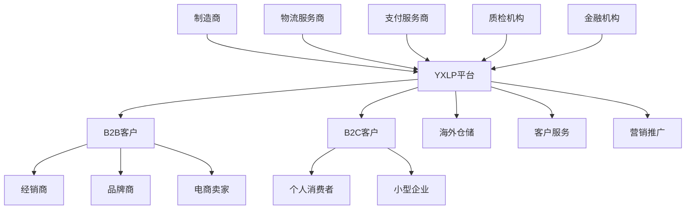
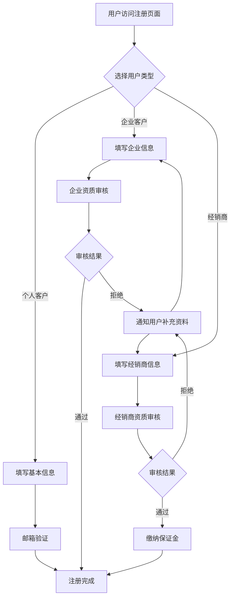
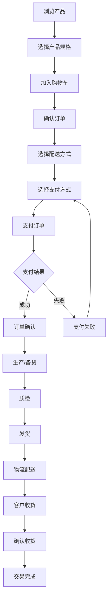
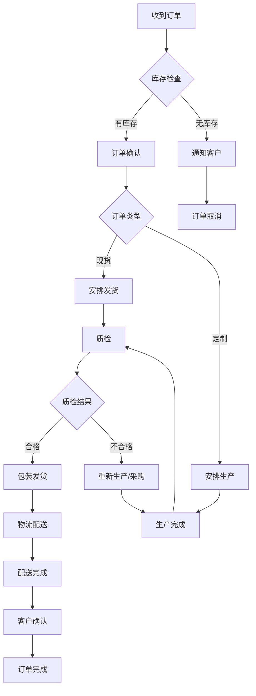
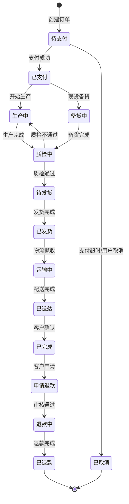
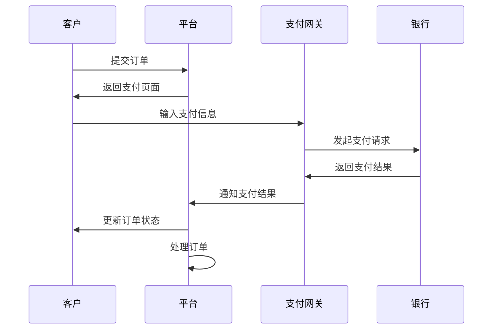
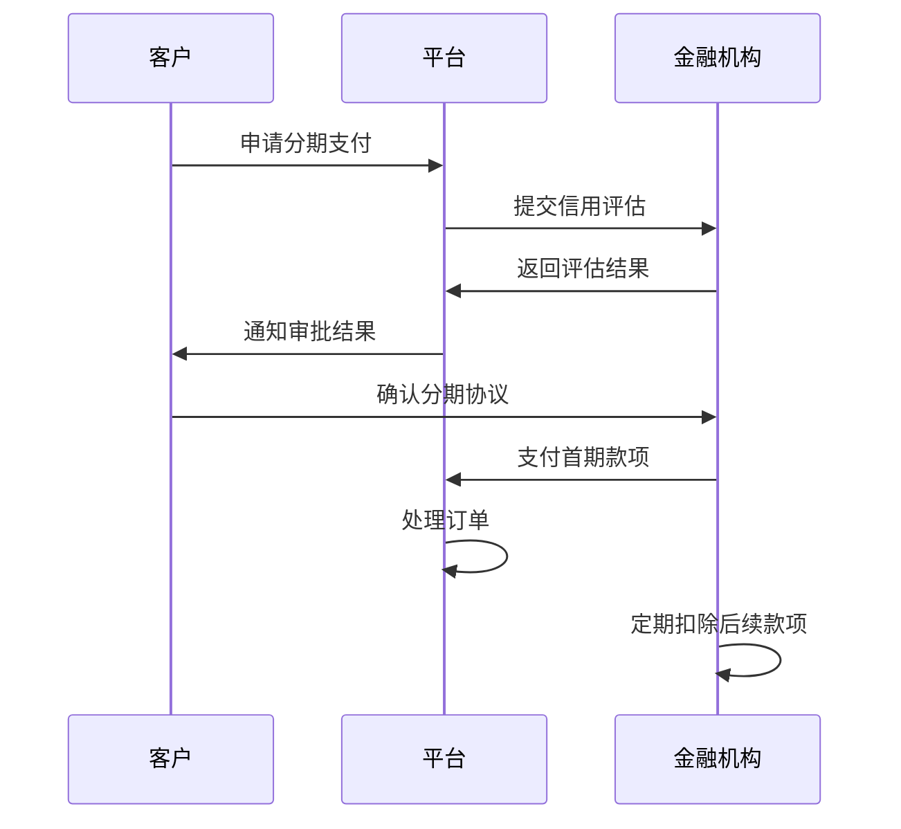

# YXLP Platform - 业务文档

## 📋 目录

1. [业务概述](#业务概述)
2. [商业模式](#商业模式)
3. [用户角色](#用户角色)
4. [核心业务流程](#核心业务流程)
5. [产品管理](#产品管理)
6. [订单管理](#订单管理)
7. [支付系统](#支付系统)
8. [物流配送](#物流配送)
9. [客户服务](#客户服务)
10. [营销推广](#营销推广)
11. [数据分析](#数据分析)
12. [合规要求](#合规要求)

## 🎯 业务概述

### 公司简介

YXLP (Your eXport Leading Partner) 是一家专注于服装出口的 B2B/B2C 电商平台，致力于为全球客户提供优质的中国制造服装产品。公司成立于2020年，总部位于中国广州，在全球50多个国家和地区开展业务。

### 核心价值主张

- **品质保证**: ISO 9001 认证制造，严格质量控制
- **价格优势**: 直接对接制造商，减少中间环节
- **快速交付**: 全球仓储网络，7-15天快速配送
- **专业服务**: 24/7 多语言客户支持
- **定制能力**: 支持 OEM/ODM 定制服务

### 业务目标

#### 短期目标 (2024年)
- 注册用户达到 50,000+
- 月活跃用户达到 15,000+
- 年销售额突破 $50M
- 覆盖 60+ 国家和地区
- 客户满意度保持 95%+

#### 中期目标 (2025-2026年)
- 注册用户达到 200,000+
- 年销售额突破 $200M
- 建立 5 个海外仓储中心
- 推出自有品牌产品线
- 上线移动端 APP

#### 长期目标 (2027-2030年)
- 成为全球领先的服装出口平台
- 年销售额突破 $1B
- 覆盖全球 100+ 国家
- 建立完整的供应链生态
- 实现可持续发展目标

## 💼 商业模式

### B2B 业务模式

#### 目标客户
- **经销商**: 服装批发商、零售商
- **品牌商**: 时尚品牌、服装公司
- **电商卖家**: 跨境电商、独立站卖家
- **企业采购**: 企业制服、工作服采购

#### 服务内容
- **批量采购**: 最低起订量 50 件
- **定制服务**: OEM/ODM 生产
- **供应链金融**: 信用支付、分期付款
- **物流服务**: 一站式物流解决方案
- **质检服务**: 第三方质量检测

#### 收入模式
- **产品销售**: 产品价格差价
- **服务费用**: 定制服务、质检费用
- **物流费用**: 国际物流服务费
- **金融服务**: 供应链金融利息
- **平台佣金**: 第三方卖家佣金

### B2C 业务模式

#### 目标客户
- **个人消费者**: 时尚爱好者
- **小型企业**: 小批量采购需求
- **设计师**: 独立设计师、工作室

#### 服务内容
- **零售销售**: 单件起售
- **个性定制**: 个人定制服务
- **快速配送**: 7-15天全球配送
- **售后服务**: 30天退换货保障

#### 收入模式
- **零售价差**: 零售价与批发价差价
- **定制费用**: 个性化定制服务费
- **配送费用**: 快递配送费用
- **会员服务**: 会员订阅费用

### 平台生态

## 👥 用户角色

### 管理员 (Admin)

#### 权限范围
- **系统管理**: 用户管理、权限设置
- **产品管理**: 产品上架、价格设置
- **订单管理**: 订单处理、状态更新
- **财务管理**: 收款、退款、对账
- **数据分析**: 销售报表、用户分析
- **客户服务**: 客诉处理、售后服务

#### 工作流程
1. **日常运营**: 监控平台运行状态
2. **产品审核**: 审核新产品上架申请
3. **订单处理**: 处理异常订单
4. **客户服务**: 处理客户投诉和咨询
5. **数据分析**: 分析业务数据，制定策略

### 经销商 (Distributor)

#### 业务特点
- **批量采购**: 大批量订单，享受批发价格
- **信用支付**: 建立信用额度，支持账期付款
- **专属服务**: 配备专属客户经理
- **定制服务**: 支持 OEM/ODM 定制
- **物流优势**: 享受物流折扣价格

#### 注册要求
- **企业资质**: 提供营业执照等企业证明
- **经营规模**: 年营业额不低于 $100K
- **信用评估**: 通过第三方信用评估
- **保证金**: 缴纳 $5,000 保证金

#### 权益保障
- **价格保护**: 享受批发价格保护
- **区域保护**: 独家代理区域保护
- **营销支持**: 提供营销物料和支持
- **培训服务**: 定期产品培训和市场培训

### 客户 (Customer)

#### 个人客户
- **注册简单**: 邮箱注册即可使用
- **零售价格**: 享受零售价格
- **小批量**: 支持单件起售
- **快速配送**: 7-15天全球配送
- **售后保障**: 30天退换货保障

#### 企业客户
- **企业认证**: 提供企业证明享受企业价格
- **批量折扣**: 根据采购量享受折扣
- **发票服务**: 提供正规发票
- **专属服务**: 大客户享受专属服务

## 🔄 核心业务流程

### 用户注册流程

### 产品采购流程

### 订单处理流程

## 📦 产品管理

### 产品分类体系

#### 一级分类
- **男装** (Men's Clothing)
  - 衬衫 (Shirts)
  - 西装 (Suits)
  - 休闲装 (Casual Wear)
  - 运动装 (Sportswear)
  - 内衣 (Underwear)

- **女装** (Women's Clothing)
  - 连衣裙 (Dresses)
  - 上衣 (Tops)
  - 下装 (Bottoms)
  - 外套 (Outerwear)
  - 内衣 (Lingerie)

- **童装** (Children's Clothing)
  - 婴儿装 (Baby Wear)
  - 儿童装 (Kids Wear)
  - 青少年装 (Teen Wear)

- **配饰** (Accessories)
  - 帽子 (Hats)
  - 包包 (Bags)
  - 围巾 (Scarves)
  - 手套 (Gloves)

### 产品信息管理

#### 基础信息
- **产品名称**: 多语言支持
- **产品描述**: 详细产品描述
- **产品图片**: 高清产品图片
- **产品视频**: 产品展示视频
- **产品规格**: 尺寸、颜色、材质等

#### 价格管理
- **成本价格**: 产品成本价
- **批发价格**: B2B 客户价格
- **零售价格**: B2C 客户价格
- **促销价格**: 活动促销价格
- **阶梯价格**: 根据数量的阶梯价格

#### 库存管理
- **库存数量**: 实时库存数量
- **安全库存**: 最低库存预警
- **预留库存**: 订单预留库存
- **在途库存**: 采购在途库存
- **库存预测**: 基于销售预测库存需求

#### 质量标准
- **材质要求**: 面料成分和质量标准
- **工艺标准**: 制作工艺要求
- **尺寸标准**: 产品尺寸规格
- **包装标准**: 产品包装要求
- **检测标准**: 质量检测标准

### 供应商管理

#### 供应商分类
- **核心供应商**: 长期合作的优质供应商
- **战略供应商**: 具有战略意义的供应商
- **一般供应商**: 普通合作供应商
- **备选供应商**: 备用供应商

#### 供应商评估
- **质量评估**: 产品质量稳定性
- **交期评估**: 交货时间准确性
- **价格评估**: 价格竞争力
- **服务评估**: 服务响应速度
- **合规评估**: 合规经营情况

#### 供应商合作
- **合同管理**: 供应合同签署和管理
- **订单管理**: 采购订单下达和跟踪
- **质量管理**: 质量标准和检验
- **付款管理**: 付款条件和结算
- **关系维护**: 供应商关系维护

## 📋 订单管理

### 订单状态管理

#### 订单状态流转

#### 状态说明
- **待支付**: 订单已创建，等待客户支付
- **已支付**: 客户已支付，等待处理
- **生产中**: 定制订单正在生产
- **备货中**: 现货订单正在备货
- **质检中**: 产品正在质量检验
- **待发货**: 产品已准备好，等待发货
- **已发货**: 产品已发货，等待物流揽收
- **运输中**: 产品正在运输途中
- **已送达**: 产品已送达客户
- **已完成**: 交易完成
- **已取消**: 订单已取消
- **申请退款**: 客户申请退款
- **退款中**: 退款申请处理中
- **已退款**: 退款已完成

### 订单类型

#### 按客户类型分类
- **B2B 订单**: 企业客户批量采购订单
- **B2C 订单**: 个人客户零售订单
- **定制订单**: OEM/ODM 定制订单
- **样品订单**: 样品采购订单

#### 按紧急程度分类
- **普通订单**: 正常交期订单
- **加急订单**: 需要加急处理的订单
- **特急订单**: 需要特急处理的订单

#### 按支付方式分类
- **预付订单**: 全额预付款订单
- **信用订单**: 信用支付订单
- **分期订单**: 分期付款订单
- **货到付款**: 货到付款订单

### 订单处理规则

#### 自动处理规则
- **库存充足**: 自动确认订单
- **库存不足**: 自动通知补货
- **支付超时**: 自动取消订单
- **异常订单**: 自动转人工处理

#### 优先级规则
1. **VIP 客户订单**: 最高优先级
2. **加急订单**: 高优先级
3. **大额订单**: 中高优先级
4. **普通订单**: 正常优先级

#### 异常处理规则
- **支付异常**: 联系客户确认支付
- **库存异常**: 通知客户调整数量或等待补货
- **地址异常**: 联系客户确认收货地址
- **产品异常**: 联系客户确认产品规格

## 💳 支付系统

### 支付方式

#### 在线支付
- **信用卡支付**: Visa、MasterCard、American Express
- **数字钱包**: PayPal、Apple Pay、Google Pay
- **银行转账**: 国际电汇、本地银行转账
- **加密货币**: Bitcoin、Ethereum (部分地区)

#### 线下支付
- **银行汇款**: 传统银行汇款
- **现金支付**: 线下现金交易
- **支票支付**: 商业支票支付

### 支付流程

#### 标准支付流程

#### 分期支付流程

### 风险控制

#### 反欺诈措施
- **实名认证**: 客户身份验证
- **地址验证**: 收货地址验证
- **设备指纹**: 设备唯一标识
- **行为分析**: 用户行为模式分析
- **黑名单**: 风险客户黑名单

#### 风险评估
- **订单金额**: 大额订单风险评估
- **支付频率**: 高频支付风险评估
- **地理位置**: 高风险地区识别
- **支付方式**: 支付方式风险评估

### 汇率管理

#### 多币种支持
- **主要货币**: USD、EUR、GBP、JPY、CNY
- **地区货币**: CAD、AUD、SGD、HKD
- **新兴货币**: INR、BRL、MXN

#### 汇率策略
- **实时汇率**: 基于实时汇率计算
- **固定汇率**: 短期固定汇率
- **汇率保护**: 大额订单汇率锁定
- **汇率风险**: 汇率波动风险管理

## 🚚 物流配送

### 配送网络

#### 全球仓储布局
- **中国仓储**: 广州、深圳、义乌主仓
- **北美仓储**: 洛杉矶、纽约海外仓
- **欧洲仓储**: 汉堡、伦敦海外仓
- **亚太仓储**: 新加坡、悉尼海外仓
- **计划仓储**: 迪拜、圣保罗仓储中心

#### 物流合作伙伴
- **国际快递**: DHL、FedEx、UPS
- **邮政系统**: EMS、各国邮政
- **专线物流**: 欧洲专线、美国专线
- **海运物流**: 集装箱海运服务

### 配送方式

#### 标准配送
- **配送时间**: 7-15 个工作日
- **配送费用**: 根据重量和目的地计算
- **跟踪服务**: 全程物流跟踪
- **保险服务**: 货物运输保险

#### 快速配送
- **配送时间**: 3-7 个工作日
- **配送费用**: 标准配送费用的 1.5-2 倍
- **优先处理**: 优先打包发货
- **专属客服**: 专属物流客服

#### 经济配送
- **配送时间**: 15-30 个工作日
- **配送费用**: 标准配送费用的 0.7-0.8 倍
- **批量发货**: 集中批量发货
- **基础跟踪**: 基础物流跟踪

### 配送政策

#### 免费配送
- **订单金额**: 单笔订单满 $100 免费配送
- **会员特权**: VIP 会员免费配送
- **促销活动**: 特定活动期间免费配送
- **地区限制**: 部分偏远地区除外

#### 配送保障
- **时效保障**: 承诺配送时效
- **安全保障**: 货物安全保障
- **损坏赔偿**: 运输损坏赔偿
- **丢失赔偿**: 货物丢失赔偿

### 海关清关

#### 清关服务
- **文件准备**: 清关文件准备
- **税费计算**: 关税和税费计算
- **清关代理**: 专业清关代理
- **异常处理**: 清关异常处理

#### 合规要求
- **产品认证**: 产品质量认证
- **标签要求**: 产品标签要求
- **文档要求**: 清关文档要求
- **法规遵循**: 各国法规遵循

## 🎯 营销推广

### 数字营销

#### 搜索引擎营销
- **SEO 优化**: 网站搜索引擎优化
- **SEM 广告**: Google Ads、Bing Ads
- **关键词策略**: 核心关键词布局
- **内容营销**: 高质量内容创作

#### 社交媒体营销
- **Facebook**: 品牌页面和广告投放
- **Instagram**: 产品展示和网红合作
- **LinkedIn**: B2B 客户开发
- **YouTube**: 产品视频和教程

#### 邮件营销
- **欢迎邮件**: 新用户欢迎邮件
- **产品推荐**: 个性化产品推荐
- **促销通知**: 促销活动通知
- **客户关怀**: 客户关怀邮件

### 促销活动

#### 季节性促销
- **春季新品**: 春季新品发布促销
- **夏季清仓**: 夏季库存清仓
- **秋冬预售**: 秋冬产品预售
- **年终大促**: 年终促销活动

#### 节日促销
- **新年促销**: 新年特别优惠
- **情人节**: 情人节主题促销
- **母亲节**: 母亲节礼品促销
- **黑色星期五**: 黑五大促销
- **圣诞节**: 圣诞节特别活动

#### 会员促销
- **新会员**: 新会员注册优惠
- **生日特惠**: 会员生日特别优惠
- **积分兑换**: 积分兑换礼品
- **等级特权**: 不同等级会员特权

### 客户获取

#### 获客渠道
- **自然流量**: SEO 和口碑推荐
- **付费广告**: 各平台付费广告
- **合作伙伴**: 渠道合作伙伴
- **展会活动**: 行业展会参展
- **推荐计划**: 客户推荐计划

#### 获客成本
- **CAC 目标**: 客户获取成本控制
- **LTV 分析**: 客户生命周期价值
- **ROI 优化**: 营销投资回报率
- **渠道效果**: 各渠道获客效果

### 客户留存

#### 留存策略
- **产品质量**: 确保产品质量
- **客户服务**: 优质客户服务
- **个性化**: 个性化推荐和服务
- **社区建设**: 客户社区建设

#### 留存指标
- **留存率**: 客户留存率监控
- **复购率**: 客户复购率分析
- **活跃度**: 客户活跃度跟踪
- **满意度**: 客户满意度调研

## 📊 数据分析

### 业务指标

#### 销售指标
- **GMV**: 总商品交易额
- **订单数**: 总订单数量
- **客单价**: 平均订单金额
- **转化率**: 访客到订单转化率
- **复购率**: 客户复购率

#### 用户指标
- **注册用户**: 累计注册用户数
- **活跃用户**: 月活跃用户数
- **新增用户**: 新增用户数
- **用户留存**: 用户留存率
- **用户价值**: 客户生命周期价值

#### 产品指标
- **浏览量**: 产品页面浏览量
- **加购率**: 加入购物车转化率
- **库存周转**: 库存周转率
- **退货率**: 产品退货率
- **评价分数**: 产品平均评分

#### 运营指标
- **客服响应**: 客服响应时间
- **订单处理**: 订单处理时间
- **发货时效**: 发货时效率
- **客户满意**: 客户满意度
- **投诉率**: 客户投诉率

### 数据报表

#### 日报
- **销售日报**: 每日销售数据
- **订单日报**: 每日订单统计
- **用户日报**: 每日用户数据
- **异常日报**: 每日异常情况

#### 周报
- **销售周报**: 每周销售分析
- **运营周报**: 每周运营数据
- **市场周报**: 每周市场动态
- **竞品周报**: 竞品分析报告

#### 月报
- **业务月报**: 月度业务总结
- **财务月报**: 月度财务报告
- **用户月报**: 月度用户分析
- **产品月报**: 月度产品分析

#### 年报
- **年度总结**: 年度业务总结
- **战略规划**: 下年度战略规划
- **市场分析**: 年度市场分析
- **竞争分析**: 年度竞争分析

### 数据驱动决策

#### 产品决策
- **新品开发**: 基于市场数据开发新品
- **库存管理**: 基于销售数据管理库存
- **价格策略**: 基于竞争数据制定价格
- **促销策略**: 基于用户行为制定促销

#### 营销决策
- **渠道投放**: 基于 ROI 数据优化渠道
- **内容策略**: 基于用户偏好制定内容
- **活动策略**: 基于历史数据设计活动
- **预算分配**: 基于效果数据分配预算

#### 运营决策
- **人员配置**: 基于业务量配置人员
- **流程优化**: 基于效率数据优化流程
- **系统升级**: 基于性能数据升级系统
- **服务改进**: 基于客户反馈改进服务

## ⚖️ 合规要求

### 法律合规

#### 国际贸易法规
- **出口许可**: 出口许可证申请
- **海关法规**: 各国海关法规遵循
- **贸易协定**: 国际贸易协定利用
- **制裁清单**: 制裁国家和实体清单

#### 产品合规
- **质量标准**: 各国产品质量标准
- **安全认证**: 产品安全认证要求
- **环保要求**: 环保法规要求
- **标签要求**: 产品标签法规要求

#### 数据保护
- **GDPR**: 欧盟数据保护法规
- **CCPA**: 加州消费者隐私法
- **个人信息**: 个人信息保护法
- **数据安全**: 数据安全法要求

### 税务合规

#### 增值税
- **VAT 注册**: 欧盟 VAT 注册
- **GST 合规**: 澳洲 GST 合规
- **销售税**: 美国各州销售税
- **税务申报**: 定期税务申报

#### 关税
- **关税计算**: 准确计算关税
- **原产地**: 原产地证明
- **优惠税率**: 优惠税率申请
- **关税减免**: 关税减免申请

### 平台合规

#### 电商平台规则
- **Amazon**: Amazon 平台规则
- **eBay**: eBay 平台规则
- **Shopify**: Shopify 应用规则
- **自建站**: 自建站合规要求

#### 支付合规
- **PCI DSS**: 支付卡行业安全标准
- **反洗钱**: 反洗钱法规要求
- **KYC**: 客户身份识别
- **资金监管**: 资金监管要求

### 质量管理

#### ISO 认证
- **ISO 9001**: 质量管理体系认证
- **ISO 14001**: 环境管理体系认证
- **ISO 45001**: 职业健康安全管理体系
- **ISO 27001**: 信息安全管理体系

#### 产品认证
- **CE 认证**: 欧盟 CE 认证
- **FCC 认证**: 美国 FCC 认证
- **CCC 认证**: 中国强制性认证
- **其他认证**: 各国特殊认证要求

---

## 📞 业务咨询

如有业务相关问题，请联系：
- **业务咨询**: business@yxlp.com
- **合作洽谈**: partnership@yxlp.com
- **客户服务**: support@yxlp.com
- **官方网站**: https://www.yxlp.com

---

*最后更新时间: 2024年1月15日*
