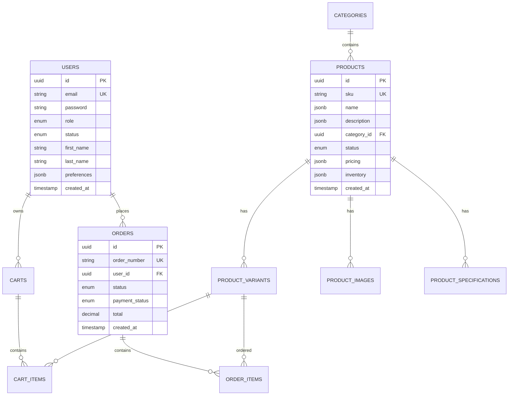

# YXLP Platform - 技术文档

## 📋 目录

1. [项目概述](#项目概述)
2. [技术架构](#技术架构)
3. [系统要求](#系统要求)
4. [安装部署](#安装部署)
5. [开发环境](#开发环境)
6. [数据库设计](#数据库设计)
7. [API 架构](#api-架构)
8. [前端架构](#前端架构)
9. [安全机制](#安全机制)
10. [性能优化](#性能优化)
11. [监控日志](#监控日志)
12. [部署策略](#部署策略)

## 🎯 项目概述

YXLP 是一个现代化的 B2B/B2C 服装出口电商平台，专为全球时尚企业提供优质的产品和服务。

### 核心功能
- **用户管理**: 多角色认证系统（管理员、经销商、客户）
- **产品管理**: 完整的产品目录、变体、库存管理
- **订单系统**: 从购物车到订单完成的全流程
- **支付集成**: 多种支付方式支持
- **国际化**: 多语言、多货币支持
- **搜索引擎**: Elasticsearch 驱动的智能搜索

### 技术特点
- **微服务架构**: 模块化设计，易于扩展
- **现代技术栈**: Next.js + NestJS + PostgreSQL
- **高性能**: Redis 缓存 + Elasticsearch 搜索
- **安全可靠**: JWT 认证 + RBAC 权限控制
- **国际化**: 完整的多语言支持

## 🏗️ 技术架构

### 整体架构图

```
┌─────────────────┐    ┌─────────────────┐    ┌─────────────────┐
│   Web Frontend  │    │  Mobile App     │    │   Admin Panel   │
│   (Next.js)     │    │  (React Native) │    │   (Next.js)     │
└─────────┬───────┘    └─────────┬───────┘    └─────────┬───────┘
          │                      │                      │
          └──────────────────────┼──────────────────────┘
                                 │
                    ┌─────────────┴─────────────┐
                    │      API Gateway          │
                    │      (NestJS)             │
                    └─────────────┬─────────────┘
                                  │
          ┌───────────────────────┼───────────────────────┐
          │                       │                       │
    ┌─────┴─────┐         ┌─────┴─────┐         ┌─────┴─────┐
    │   Auth    │         │ Products  │         │  Orders   │
    │ Service   │         │ Service   │         │ Service   │
    └─────┬─────┘         └─────┬─────┘         └─────┬─────┘
          │                     │                     │
          └─────────────────────┼─────────────────────┘
                                │
                    ┌─────────────┴─────────────┐
                    │      Data Layer           │
                    └─────────────┬─────────────┘
                                  │
    ┌─────────────┬───────────────┼───────────────┬─────────────┐
    │             │               │               │             │
┌───┴───┐   ┌───┴───┐   ┌─────┴─────┐   ┌───┴───┐   ┌───┴───┐
│ Redis │   │ PostgreSQL │ Elasticsearch │ MinIO │   │ Queue │
│ Cache │   │ Database   │   Search      │ Files │   │ Jobs  │
└───────┘   └───────────┘ └───────────┘   └───────┘   └───────┘
```

### 技术栈详情

#### 前端技术栈
- **框架**: Next.js 14 (App Router)
- **语言**: TypeScript
- **样式**: Tailwind CSS
- **状态管理**: Zustand
- **表单处理**: React Hook Form + Zod
- **HTTP 客户端**: Axios
- **图标**: Lucide React

#### 后端技术栈
- **框架**: NestJS
- **语言**: TypeScript
- **数据库**: PostgreSQL 15
- **ORM**: TypeORM
- **缓存**: Redis
- **搜索**: Elasticsearch
- **文件存储**: MinIO (S3 兼容)
- **队列**: Bull Queue
- **认证**: JWT + Passport

#### 基础设施
- **容器化**: Docker + Docker Compose
- **反向代理**: Nginx
- **监控**: Prometheus + Grafana
- **日志**: ELK Stack
- **CI/CD**: GitHub Actions
- **部署**: Kubernetes

## 💻 系统要求

### 开发环境
- **Node.js**: >= 18.0.0
- **npm**: >= 9.0.0
- **Docker**: >= 20.0.0
- **Docker Compose**: >= 2.0.0

### 生产环境
- **CPU**: 4 核心以上
- **内存**: 8GB 以上
- **存储**: 100GB SSD
- **网络**: 100Mbps 带宽

### 数据库要求
- **PostgreSQL**: >= 15.0
- **Redis**: >= 7.0
- **Elasticsearch**: >= 8.0

## 🚀 安装部署

### 快速开始

1. **克隆项目**
```bash
git clone https://github.com/your-org/yxlp-platform.git
cd yxlp-platform
```

2. **环境配置**
```bash
# 复制环境变量文件
cp .env.example .env

# 编辑环境变量
nano .env
```

3. **启动服务**
```bash
# 使用 Docker Compose 启动所有服务
docker-compose up -d

# 或者分别启动
npm run dev:api    # 启动后端 API
npm run dev:web    # 启动前端应用
```

4. **数据库初始化**
```bash
# 运行数据库迁移
npm run migration:run

# 导入测试数据
npm run seed:run
```

### 环境变量配置

```bash
# 应用配置
NODE_ENV=development
PORT=3001
WEB_PORT=3000

# 数据库配置
DATABASE_HOST=localhost
DATABASE_PORT=5432
DATABASE_USERNAME=yxlp
DATABASE_PASSWORD=your_password
DATABASE_NAME=yxlp_db

# Redis 配置
REDIS_HOST=localhost
REDIS_PORT=6379
REDIS_PASSWORD=your_redis_password

# JWT 配置
JWT_SECRET=your_jwt_secret_key
JWT_EXPIRES_IN=15m
JWT_REFRESH_SECRET=your_refresh_secret
JWT_REFRESH_EXPIRES_IN=7d

# Elasticsearch 配置
ELASTICSEARCH_NODE=http://localhost:9200
ELASTICSEARCH_USERNAME=elastic
ELASTICSEARCH_PASSWORD=your_es_password

# 文件存储配置
MINIO_ENDPOINT=localhost
MINIO_PORT=9000
MINIO_ACCESS_KEY=your_access_key
MINIO_SECRET_KEY=your_secret_key
MINIO_BUCKET_NAME=yxlp-files

# 邮件配置
SMTP_HOST=smtp.gmail.com
SMTP_PORT=587
SMTP_USER=your_email@gmail.com
SMTP_PASS=your_app_password

# 支付配置
STRIPE_SECRET_KEY=sk_test_...
STRIPE_WEBHOOK_SECRET=whsec_...
PAYPAL_CLIENT_ID=your_paypal_client_id
PAYPAL_CLIENT_SECRET=your_paypal_secret
```

## 🛠️ 开发环境

### 项目结构

```
yxlp-platform/
├── apps/
│   ├── api/                    # 后端 API 应用
│   │   ├── src/
│   │   │   ├── modules/        # 业务模块
│   │   │   │   ├── auth/       # 认证模块
│   │   │   │   ├── products/   # 产品模块
│   │   │   │   ├── orders/     # 订单模块
│   │   │   │   ├── cart/       # 购物车模块
│   │   │   │   └── users/      # 用户模块
│   │   │   ├── common/         # 公共模块
│   │   │   ├── config/         # 配置文件
│   │   │   └── main.ts         # 应用入口
│   │   ├── test/               # 测试文件
│   │   └── package.json
│   └── web/                    # 前端 Web 应用
│       ├── src/
│       │   ├── app/            # Next.js App Router
│       │   ├── components/     # React 组件
│       │   ├── lib/            # 工具库
│       │   ├── stores/         # 状态管理
│       │   └── types/          # TypeScript 类型
│       ├── public/             # 静态资源
│       └── package.json
├── packages/
│   ├── types/                  # 共享类型定义
│   ├── utils/                  # 共享工具函数
│   └── config/                 # 共享配置
├── docs/                       # 文档目录
├── scripts/                    # 脚本文件
├── docker-compose.yml          # Docker 编排文件
├── package.json                # 根 package.json
└── README.md
```

### 开发工作流

1. **代码规范**
```bash
# 代码格式化
npm run format

# 代码检查
npm run lint

# 类型检查
npm run type-check
```

2. **测试**
```bash
# 运行单元测试
npm run test

# 运行集成测试
npm run test:e2e

# 测试覆盖率
npm run test:cov
```

3. **数据库操作**
```bash
# 生成迁移文件
npm run migration:generate -- --name=CreateUserTable

# 运行迁移
npm run migration:run

# 回滚迁移
npm run migration:revert

# 生成种子数据
npm run seed:create -- --name=UserSeeder

# 运行种子数据
npm run seed:run
```

## 🗄️ 数据库设计

### 核心表结构

#### 用户表 (users)
```sql
CREATE TABLE users (
    id UUID PRIMARY KEY DEFAULT gen_random_uuid(),
    email VARCHAR(255) UNIQUE NOT NULL,
    username VARCHAR(100),
    password VARCHAR(255) NOT NULL,
    role user_role NOT NULL DEFAULT 'customer',
    status user_status NOT NULL DEFAULT 'pending',
    first_name VARCHAR(100) NOT NULL,
    last_name VARCHAR(100) NOT NULL,
    avatar VARCHAR(500),
    phone VARCHAR(50),
    country VARCHAR(2) NOT NULL,
    language VARCHAR(5) DEFAULT 'en',
    preferences JSONB DEFAULT '{}',
    email_verified_at TIMESTAMP,
    last_login_at TIMESTAMP,
    created_at TIMESTAMP DEFAULT NOW(),
    updated_at TIMESTAMP DEFAULT NOW()
);
```

#### 产品表 (products)
```sql
CREATE TABLE products (
    id UUID PRIMARY KEY DEFAULT gen_random_uuid(),
    sku VARCHAR(100) UNIQUE NOT NULL,
    name JSONB NOT NULL,
    description JSONB NOT NULL,
    short_description JSONB,
    category_id UUID NOT NULL,
    brand VARCHAR(100),
    tags TEXT[],
    status product_status DEFAULT 'draft',
    seo JSONB NOT NULL,
    pricing JSONB NOT NULL,
    inventory JSONB NOT NULL,
    shipping JSONB NOT NULL,
    metadata JSONB DEFAULT '{}',
    view_count INTEGER DEFAULT 0,
    order_count INTEGER DEFAULT 0,
    average_rating DECIMAL(3,2) DEFAULT 0,
    review_count INTEGER DEFAULT 0,
    published_at TIMESTAMP,
    created_at TIMESTAMP DEFAULT NOW(),
    updated_at TIMESTAMP DEFAULT NOW(),
    FOREIGN KEY (category_id) REFERENCES categories(id)
);
```

#### 订单表 (orders)
```sql
CREATE TABLE orders (
    id UUID PRIMARY KEY DEFAULT gen_random_uuid(),
    order_number VARCHAR(50) UNIQUE NOT NULL,
    user_id UUID,
    status order_status DEFAULT 'pending',
    payment_status payment_status DEFAULT 'pending',
    fulfillment_status fulfillment_status DEFAULT 'unfulfilled',
    customer JSONB NOT NULL,
    shipping_address JSONB NOT NULL,
    billing_address JSONB NOT NULL,
    shipping JSONB NOT NULL,
    payment JSONB NOT NULL,
    discounts JSONB DEFAULT '[]',
    taxes JSONB DEFAULT '[]',
    subtotal DECIMAL(10,2) NOT NULL,
    discount_amount DECIMAL(10,2) DEFAULT 0,
    tax_amount DECIMAL(10,2) DEFAULT 0,
    shipping_amount DECIMAL(10,2) DEFAULT 0,
    total DECIMAL(10,2) NOT NULL,
    paid_amount DECIMAL(10,2) DEFAULT 0,
    refunded_amount DECIMAL(10,2) DEFAULT 0,
    metadata JSONB DEFAULT '{}',
    processed_at TIMESTAMP,
    shipped_at TIMESTAMP,
    delivered_at TIMESTAMP,
    cancelled_at TIMESTAMP,
    created_at TIMESTAMP DEFAULT NOW(),
    updated_at TIMESTAMP DEFAULT NOW(),
    FOREIGN KEY (user_id) REFERENCES users(id)
);
```

### 索引策略

```sql
-- 用户表索引
CREATE INDEX idx_users_email ON users(email);
CREATE INDEX idx_users_role ON users(role);
CREATE INDEX idx_users_status ON users(status);
CREATE INDEX idx_users_created_at ON users(created_at);

-- 产品表索引
CREATE INDEX idx_products_sku ON products(sku);
CREATE INDEX idx_products_status_category ON products(status, category_id);
CREATE INDEX idx_products_created_at ON products(created_at);
CREATE INDEX idx_products_order_count ON products(order_count);
CREATE INDEX idx_products_rating ON products(average_rating);

-- 订单表索引
CREATE INDEX idx_orders_user_id ON orders(user_id);
CREATE INDEX idx_orders_status ON orders(status);
CREATE INDEX idx_orders_created_at ON orders(created_at);
CREATE INDEX idx_orders_order_number ON orders(order_number);
```

### 数据关系图



## 🔌 API 架构

### RESTful API 设计

#### 认证相关 API
```
POST   /api/auth/register          # 用户注册
POST   /api/auth/login             # 用户登录
POST   /api/auth/refresh           # 刷新令牌
POST   /api/auth/logout            # 用户登出
POST   /api/auth/forgot-password   # 忘记密码
POST   /api/auth/reset-password    # 重置密码
GET    /api/auth/me                # 获取当前用户信息
```

#### 产品相关 API
```
GET    /api/products               # 获取产品列表
GET    /api/products/:id           # 获取产品详情
POST   /api/products               # 创建产品 (管理员)
PUT    /api/products/:id           # 更新产品 (管理员)
DELETE /api/products/:id           # 删除产品 (管理员)
GET    /api/products/search        # 搜索产品
GET    /api/products/featured      # 获取推荐产品
GET    /api/products/bestsellers   # 获取热销产品
```

#### 购物车相关 API
```
GET    /api/cart                   # 获取购物车
POST   /api/cart/add               # 添加商品到购物车
PUT    /api/cart/items/:id         # 更新购物车商品
DELETE /api/cart/items/:id         # 删除购物车商品
DELETE /api/cart                   # 清空购物车
```

#### 订单相关 API
```
GET    /api/orders                 # 获取订单列表
GET    /api/orders/:id             # 获取订单详情
POST   /api/orders                 # 创建订单
PUT    /api/orders/:id             # 更新订单状态
POST   /api/orders/:id/cancel      # 取消订单
POST   /api/orders/:id/refund      # 申请退款
```

### API 响应格式

#### 成功响应
```json
{
  "success": true,
  "data": {
    // 响应数据
  },
  "message": "操作成功",
  "timestamp": "2024-01-15T10:30:00Z"
}
```

#### 分页响应
```json
{
  "success": true,
  "data": {
    "items": [...],
    "pagination": {
      "page": 1,
      "limit": 20,
      "total": 100,
      "totalPages": 5
    }
  }
}
```

#### 错误响应
```json
{
  "success": false,
  "error": {
    "code": "VALIDATION_ERROR",
    "message": "输入数据验证失败",
    "details": [
      {
        "field": "email",
        "message": "邮箱格式不正确"
      }
    ]
  },
  "timestamp": "2024-01-15T10:30:00Z"
}
```

### API 认证

#### JWT Token 结构
```json
{
  "header": {
    "alg": "HS256",
    "typ": "JWT"
  },
  "payload": {
    "sub": "user-uuid",
    "email": "user@example.com",
    "role": "customer",
    "iat": 1642248600,
    "exp": 1642249500
  }
}
```

#### 请求头格式
```http
Authorization: Bearer <access_token>
Content-Type: application/json
Accept: application/json
X-API-Version: v1
```

### API 限流策略

```typescript
// 全局限流
@Throttle({ default: { limit: 100, ttl: 60000 } }) // 每分钟100次

// 登录限流
@Throttle({ default: { limit: 5, ttl: 60000 } })   // 每分钟5次

// 搜索限流
@Throttle({ default: { limit: 30, ttl: 60000 } })  // 每分钟30次
```

## 🎨 前端架构

### 组件架构

```
src/
├── app/                        # Next.js App Router
│   ├── (auth)/                 # 认证相关页面
│   │   ├── login/
│   │   └── register/
│   ├── products/               # 产品相关页面
│   │   ├── [id]/
│   │   └── page.tsx
│   ├── cart/                   # 购物车页面
│   ├── dashboard/              # 用户仪表板
│   ├── globals.css             # 全局样式
│   ├── layout.tsx              # 根布局
│   └── page.tsx                # 首页
├── components/                 # React 组件
│   ├── auth/                   # 认证组件
│   │   ├── LoginForm.tsx
│   │   ├── RegisterForm.tsx
│   │   └── ProtectedRoute.tsx
│   ├── layout/                 # 布局组件
│   │   ├── Header.tsx
│   │   ├── Footer.tsx
│   │   └── Sidebar.tsx
│   ├── products/               # 产品组件
│   │   ├── ProductCard.tsx
│   │   ├── ProductGrid.tsx
│   │   └── ProductFilter.tsx
│   └── ui/                     # 基础 UI 组件
│       ├── Button.tsx
│       ├── Input.tsx
│       └── Modal.tsx
├── lib/                        # 工具库
│   ├── api.ts                  # API 客户端
│   ├── auth.ts                 # 认证工具
│   └── utils.ts                # 通用工具
├── stores/                     # 状态管理
│   ├── authStore.ts            # 认证状态
│   ├── cartStore.ts            # 购物车状态
│   └── productStore.ts         # 产品状态
└── types/                      # TypeScript 类型
    ├── auth.ts
    ├── product.ts
    └── order.ts
```

### 状态管理

使用 Zustand 进行状态管理：

```typescript
// authStore.ts
interface AuthState {
  user: User | null
  isAuthenticated: boolean
  isLoading: boolean
  login: (credentials: LoginCredentials) => Promise<void>
  logout: () => Promise<void>
  checkAuth: () => Promise<void>
}

export const useAuthStore = create<AuthState>()(
  persist(
    (set, get) => ({
      user: null,
      isAuthenticated: false,
      isLoading: false,
      
      login: async (credentials) => {
        // 登录逻辑
      },
      
      logout: async () => {
        // 登出逻辑
      },
      
      checkAuth: async () => {
        // 检查认证状态
      }
    }),
    {
      name: 'auth-storage',
      partialize: (state) => ({
        user: state.user,
        isAuthenticated: state.isAuthenticated
      })
    }
  )
)
```

### 路由保护

```typescript
// ProtectedRoute.tsx
export default function ProtectedRoute({ 
  children, 
  requiredRoles = [] 
}: ProtectedRouteProps) {
  const { user, isAuthenticated, isLoading } = useAuthStore()
  
  if (isLoading) return <LoadingSpinner />
  
  if (!isAuthenticated) {
    redirect('/login')
  }
  
  if (requiredRoles.length > 0 && !hasRole(user, requiredRoles)) {
    redirect('/unauthorized')
  }
  
  return <>{children}</>
}
```

### 国际化支持

```typescript
// i18n.ts
export const i18n = {
  defaultLocale: 'en',
  locales: ['en', 'zh', 'es', 'fr', 'de'],
  
  // 语言检测
  detectLanguage: () => {
    if (typeof window !== 'undefined') {
      return localStorage.getItem('language') || 
             navigator.language.split('-')[0] || 
             'en'
    }
    return 'en'
  },
  
  // 设置语言
  setLanguage: (locale: string) => {
    if (typeof window !== 'undefined') {
      localStorage.setItem('language', locale)
    }
  }
}
```

## 🔒 安全机制

### 认证安全

1. **JWT Token 安全**
```typescript
// JWT 配置
{
  secret: process.env.JWT_SECRET, // 强密钥
  expiresIn: '15m',               // 短期有效期
  algorithm: 'HS256'              // 安全算法
}

// Refresh Token 配置
{
  secret: process.env.JWT_REFRESH_SECRET,
  expiresIn: '7d',
  httpOnly: true,    // 防止 XSS
  secure: true,      // HTTPS only
  sameSite: 'strict' // CSRF 保护
}
```

2. **密码安全**
```typescript
// 密码加密
const saltRounds = 12
const hashedPassword = await bcrypt.hash(password, saltRounds)

// 密码验证
const isValid = await bcrypt.compare(password, hashedPassword)
```

3. **账户保护**
```typescript
// 登录失败锁定
if (user.loginAttempts >= 5) {
  user.lockedUntil = new Date(Date.now() + 30 * 60 * 1000) // 30分钟
}
```

### 数据安全

1. **输入验证**
```typescript
// 使用 class-validator 进行验证
export class CreateUserDto {
  @IsEmail()
  @IsNotEmpty()
  email: string

  @IsString()
  @MinLength(8)
  @Matches(/^(?=.*[a-z])(?=.*[A-Z])(?=.*\d)/)
  password: string
}
```

2. **SQL 注入防护**
```typescript
// 使用 TypeORM 参数化查询
const user = await this.userRepository.findOne({
  where: { email: email } // 自动转义
})
```

3. **XSS 防护**
```typescript
// 输出转义
import { escape } from 'html-escaper'
const safeContent = escape(userInput)
```

### API 安全

1. **CORS 配置**
```typescript
app.enableCors({
  origin: process.env.ALLOWED_ORIGINS?.split(',') || ['http://localhost:3000'],
  credentials: true,
  methods: ['GET', 'POST', 'PUT', 'DELETE', 'PATCH'],
  allowedHeaders: ['Content-Type', 'Authorization']
})
```

2. **请求限流**
```typescript
// 全局限流
@UseGuards(ThrottlerGuard)
@Throttle({ default: { limit: 100, ttl: 60000 } })

// 敏感操作限流
@Throttle({ default: { limit: 5, ttl: 60000 } })
```

3. **请求大小限制**
```typescript
app.use(express.json({ limit: '10mb' }))
app.use(express.urlencoded({ limit: '10mb', extended: true }))
```

### 数据隐私

1. **敏感数据脱敏**
```typescript
@Exclude()
password: string

@Exclude()
refreshTokens: string[]

toJSON() {
  const { password, refreshTokens, ...result } = this
  return result
}
```

2. **GDPR 合规**
```typescript
// 数据导出
async exportUserData(userId: string) {
  return {
    profile: await this.getUserProfile(userId),
    orders: await this.getUserOrders(userId),
    preferences: await this.getUserPreferences(userId)
  }
}

// 数据删除
async deleteUserData(userId: string) {
  await this.anonymizeUserData(userId)
  await this.deleteUserAccount(userId)
}
```

## ⚡ 性能优化

### 数据库优化

1. **索引策略**
```sql
-- 复合索引
CREATE INDEX idx_products_status_category_created 
ON products(status, category_id, created_at DESC);

-- 部分索引
CREATE INDEX idx_active_products 
ON products(created_at DESC) 
WHERE status = 'active';

-- 表达式索引
CREATE INDEX idx_products_name_gin 
ON products USING gin((name::text));
```

2. **查询优化**
```typescript
// 使用 select 减少数据传输
const products = await this.productRepository
  .createQueryBuilder('product')
  .select(['product.id', 'product.name', 'product.price'])
  .where('product.status = :status', { status: 'active' })
  .getMany()

// 使用 join 减少查询次数
const productsWithCategory = await this.productRepository
  .createQueryBuilder('product')
  .leftJoinAndSelect('product.category', 'category')
  .getMany()
```

3. **连接池配置**
```typescript
{
  type: 'postgres',
  host: process.env.DATABASE_HOST,
  port: parseInt(process.env.DATABASE_PORT),
  username: process.env.DATABASE_USERNAME,
  password: process.env.DATABASE_PASSWORD,
  database: process.env.DATABASE_NAME,
  extra: {
    max: 20,           // 最大连接数
    min: 5,            // 最小连接数
    idleTimeoutMillis: 30000,
    connectionTimeoutMillis: 2000,
  }
}
```

### 缓存策略

1. **Redis 缓存**
```typescript
// 产品缓存
@Cacheable('products', 300) // 5分钟缓存
async getProduct(id: string): Promise<Product> {
  return this.productRepository.findOne({ where: { id } })
}

// 用户会话缓存
@Cacheable('user-sessions', 3600) // 1小时缓存
async getUserSession(userId: string) {
  return this.userRepository.findOne({ where: { id: userId } })
}
```

2. **HTTP 缓存**
```typescript
// 静态资源缓存
@Header('Cache-Control', 'public, max-age=31536000') // 1年
@Get('static/*')
serveStatic() {
  // 静态文件服务
}

// API 响应缓存
@Header('Cache-Control', 'public, max-age=300') // 5分钟
@Get('products')
getProducts() {
  // 产品列表
}
```

### 前端优化

1. **代码分割**
```typescript
// 路由级别分割
const ProductPage = lazy(() => import('./pages/ProductPage'))
const CartPage = lazy(() => import('./pages/CartPage'))

// 组件级别分割
const HeavyComponent = lazy(() => import('./components/HeavyComponent'))
```

2. **图片优化**
```typescript
// Next.js Image 组件
<Image
  src="/product-image.jpg"
  alt="Product"
  width={400}
  height={300}
  placeholder="blur"
  blurDataURL="data:image/jpeg;base64,..."
  priority={isAboveFold}
/>
```

3. **预加载策略**
```typescript
// 关键资源预加载
<link rel="preload" href="/fonts/inter.woff2" as="font" type="font/woff2" crossOrigin="" />

// 路由预取
<Link href="/products" prefetch={true}>
  Products
</Link>
```

### 搜索优化

1. **Elasticsearch 配置**
```json
{
  "settings": {
    "number_of_shards": 3,
    "number_of_replicas": 1,
    "analysis": {
      "analyzer": {
        "product_analyzer": {
          "type": "custom",
          "tokenizer": "standard",
          "filter": ["lowercase", "stop", "snowball"]
        }
      }
    }
  },
  "mappings": {
    "properties": {
      "name": {
        "type": "text",
        "analyzer": "product_analyzer",
        "fields": {
          "keyword": {
            "type": "keyword"
          }
        }
      }
    }
  }
}
```

2. **搜索优化**
```typescript
// 多字段搜索
const searchQuery = {
  multi_match: {
    query: searchTerm,
    fields: [
      'name^3',           // 名称权重最高
      'description^2',    // 描述权重中等
      'brand',           // 品牌权重正常
      'tags'             // 标签权重正常
    ],
    fuzziness: 'AUTO'    // 模糊匹配
  }
}

// 聚合搜索
const aggregations = {
  categories: {
    terms: { field: 'category.keyword' }
  },
  price_ranges: {
    range: {
      field: 'price',
      ranges: [
        { to: 50 },
        { from: 50, to: 100 },
        { from: 100, to: 200 },
        { from: 200 }
      ]
    }
  }
}
```

## 📊 监控日志

### 应用监控

1. **健康检查**
```typescript
@Controller('health')
export class HealthController {
  @Get()
  @HealthCheck()
  check() {
    return this.health.check([
      () => this.db.pingCheck('database'),
      () => this.redis.pingCheck('redis'),
      () => this.elasticsearch.pingCheck('elasticsearch')
    ])
  }
}
```

2. **性能监控**
```typescript
// 响应时间监控
@UseInterceptors(LoggingInterceptor)
@Controller('api')
export class ApiController {
  // API 方法
}

// 内存使用监控
setInterval(() => {
  const memUsage = process.memoryUsage()
  logger.info('Memory usage', {
    rss: memUsage.rss / 1024 / 1024,
    heapTotal: memUsage.heapTotal / 1024 / 1024,
    heapUsed: memUsage.heapUsed / 1024 / 1024
  })
}, 60000) // 每分钟记录一次
```

### 日志系统

1. **结构化日志**
```typescript
// Winston 配置
const logger = winston.createLogger({
  level: 'info',
  format: winston.format.combine(
    winston.format.timestamp(),
    winston.format.errors({ stack: true }),
    winston.format.json()
  ),
  transports: [
    new winston.transports.File({ filename: 'error.log', level: 'error' }),
    new winston.transports.File({ filename: 'combined.log' }),
    new winston.transports.Console({
      format: winston.format.simple()
    })
  ]
})

// 使用示例
logger.info('User login', {
  userId: user.id,
  email: user.email,
  ip: req.ip,
  userAgent: req.get('User-Agent')
})
```

2. **错误追踪**
```typescript
// 全局异常过滤器
@Catch()
export class AllExceptionsFilter implements ExceptionFilter {
  catch(exception: unknown, host: ArgumentsHost) {
    const ctx = host.switchToHttp()
    const response = ctx.getResponse()
    const request = ctx.getRequest()

    logger.error('Unhandled exception', {
      error: exception,
      url: request.url,
      method: request.method,
      body: request.body,
      query: request.query,
      params: request.params,
      headers: request.headers
    })

    response.status(500).json({
      success: false,
      error: {
        code: 'INTERNAL_SERVER_ERROR',
        message: 'An unexpected error occurred'
      },
      timestamp: new Date().toISOString()
    })
  }
}
```

### 业务指标

1. **关键指标监控**
```typescript
// 业务指标收集
export class MetricsService {
  private readonly metrics = {
    userRegistrations: new Counter({
      name: 'user_registrations_total',
      help: 'Total number of user registrations'
    }),
    
    orderCreated: new Counter({
      name: 'orders_created_total',
      help: 'Total number of orders created'
    }),
    
    responseTime: new Histogram({
      name: 'http_request_duration_seconds',
      help: 'Duration of HTTP requests in seconds',
      labelNames: ['method', 'route', 'status']
    })
  }

  recordUserRegistration() {
    this.metrics.userRegistrations.inc()
  }

  recordOrderCreated(amount: number) {
    this.metrics.orderCreated.inc()
  }

  recordResponseTime(method: string, route: string, status: number, duration: number) {
    this.metrics.responseTime
      .labels(method, route, status.toString())
      .observe(duration)
  }
}
```

2. **告警配置**
```yaml
# Prometheus 告警规则
groups:
  - name: yxlp-alerts
    rules:
      - alert: HighErrorRate
        expr: rate(http_requests_total{status=~"5.."}[5m]) > 0.1
        for: 5m
        labels:
          severity: critical
        annotations:
          summary: "High error rate detected"
          description: "Error rate is {{ $value }} errors per second"

      - alert: DatabaseConnectionHigh
        expr: database_connections_active / database_connections_max > 0.8
        for: 2m
        labels:
          severity: warning
        annotations:
          summary: "Database connection usage high"
```

## 🚀 部署策略

### Docker 部署

1. **Dockerfile 优化**
```dockerfile
# 多阶段构建
FROM node:18-alpine AS builder
WORKDIR /app
COPY package*.json ./
RUN npm ci --only=production

FROM node:18-alpine AS runtime
WORKDIR /app
COPY --from=builder /app/node_modules ./node_modules
COPY . .
EXPOSE 3001
CMD ["npm", "run", "start:prod"]
```

2. **Docker Compose 配置**
```yaml
version: '3.8'
services:
  api:
    build: ./apps/api
    ports:
      - "3001:3001"
    environment:
      - NODE_ENV=production
      - DATABASE_HOST=postgres
      - REDIS_HOST=redis
    depends_on:
      - postgres
      - redis
    restart: unless-stopped

  web:
    build: ./apps/web
    ports:
      - "3000:3000"
    environment:
      - NEXT_PUBLIC_API_URL=http://api:3001
    depends_on:
      - api
    restart: unless-stopped

  postgres:
    image: postgres:15-alpine
    environment:
      POSTGRES_DB: yxlp_db
      POSTGRES_USER: yxlp
      POSTGRES_PASSWORD: ${DATABASE_PASSWORD}
    volumes:
      - postgres_data:/var/lib/postgresql/data
    restart: unless-stopped

  redis:
    image: redis:7-alpine
    command: redis-server --requirepass ${REDIS_PASSWORD}
    volumes:
      - redis_data:/data
    restart: unless-stopped

volumes:
  postgres_data:
  redis_data:
```

### Kubernetes 部署

1. **部署配置**
```yaml
apiVersion: apps/v1
kind: Deployment
metadata:
  name: yxlp-api
spec:
  replicas: 3
  selector:
    matchLabels:
      app: yxlp-api
  template:
    metadata:
      labels:
        app: yxlp-api
    spec:
      containers:
      - name: api
        image: yxlp/api:latest
        ports:
        - containerPort: 3001
        env:
        - name: DATABASE_HOST
          value: "postgres-service"
        - name: REDIS_HOST
          value: "redis-service"
        resources:
          requests:
            memory: "256Mi"
            cpu: "250m"
          limits:
            memory: "512Mi"
            cpu: "500m"
        livenessProbe:
          httpGet:
            path: /health
            port: 3001
          initialDelaySeconds: 30
          periodSeconds: 10
        readinessProbe:
          httpGet:
            path: /health
            port: 3001
          initialDelaySeconds: 5
          periodSeconds: 5
```

2. **服务配置**
```yaml
apiVersion: v1
kind: Service
metadata:
  name: yxlp-api-service
spec:
  selector:
    app: yxlp-api
  ports:
  - protocol: TCP
    port: 80
    targetPort: 3001
  type: LoadBalancer
```

### CI/CD 流程

1. **GitHub Actions 配置**
```yaml
name: CI/CD Pipeline

on:
  push:
    branches: [main, develop]
  pull_request:
    branches: [main]

jobs:
  test:
    runs-on: ubuntu-latest
    steps:
      - uses: actions/checkout@v3
      - uses: actions/setup-node@v3
        with:
          node-version: '18'
          cache: 'npm'
      
      - run: npm ci
      - run: npm run lint
      - run: npm run test
      - run: npm run build

  build-and-deploy:
    needs: test
    runs-on: ubuntu-latest
    if: github.ref == 'refs/heads/main'
    
    steps:
      - uses: actions/checkout@v3
      
      - name: Build Docker images
        run: |
          docker build -t yxlp/api:${{ github.sha }} ./apps/api
          docker build -t yxlp/web:${{ github.sha }} ./apps/web
      
      - name: Push to registry
        run: |
          echo ${{ secrets.DOCKER_PASSWORD }} | docker login -u ${{ secrets.DOCKER_USERNAME }} --password-stdin
          docker push yxlp/api:${{ github.sha }}
          docker push yxlp/web:${{ github.sha }}
      
      - name: Deploy to Kubernetes
        run: |
          kubectl set image deployment/yxlp-api api=yxlp/api:${{ github.sha }}
          kubectl set image deployment/yxlp-web web=yxlp/web:${{ github.sha }}
```

### 生产环境配置

1. **环境变量管理**
```bash
# 使用 Kubernetes Secrets
kubectl create secret generic yxlp-secrets \
  --from-literal=database-password=$DATABASE_PASSWORD \
  --from-literal=jwt-secret=$JWT_SECRET \
  --from-literal=redis-password=$REDIS_PASSWORD
```

2. **负载均衡配置**
```nginx
upstream yxlp_api {
    server api-1:3001;
    server api-2:3001;
    server api-3:3001;
}

server {
    listen 80;
    server_name api.yxlp.com;
    
    location / {
        proxy_pass http://yxlp_api;
        proxy_set_header Host $host;
        proxy_set_header X-Real-IP $remote_addr;
        proxy_set_header X-Forwarded-For $proxy_add_x_forwarded_for;
        proxy_set_header X-Forwarded-Proto $scheme;
    }
}
```

3. **SSL 证书配置**
```yaml
apiVersion: cert-manager.io/v1
kind: Certificate
metadata:
  name: yxlp-tls
spec:
  secretName: yxlp-tls-secret
  issuerRef:
    name: letsencrypt-prod
    kind: ClusterIssuer
  dnsNames:
  - yxlp.com
  - www.yxlp.com
  - api.yxlp.com
```

---

## 📞 技术支持

如有技术问题，请联系：
- **邮箱**: tech-support@yxlp.com
- **文档**: https://docs.yxlp.com
- **GitHub**: https://github.com/yxlp/platform

---

*最后更新时间: 2024年1月15日*
